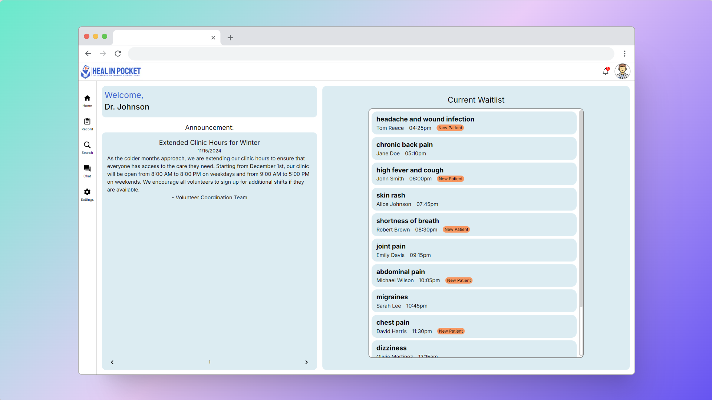

# **HEAL IN POCKET**

Welcome to **Heal in Pocket**, a web-based electronic health record (EHR) system designed for medical outreach. Our platform bridges healthcare gaps by offering a user-friendly, secure solution accessible from any device. Heal in Pocket ensures that underserved communities receive efficient, accessible care, anytime, anywhere.
Our responsive web app adapts to any screen size—whether on an iPad, iPhone, or PC browser. The intuitive user interface is designed for ease of use, making it simple for healthcare providers to deliver quality care across all devices.

---

## 🚀 **Live Demo**

🌐 **Visit the App**: [Heal in Pocket](https://heal-in-pocket.vercel.app/)  
_Experience the platform live by clicking the link above!_

---

## 📱 **Responsive Design**

Our responsive web app adapts to any screen size—whether on an **iPad**, **iPhone**, or **PC browser**. The intuitive user interface is designed for **ease of use**, allowing healthcare providers to deliver quality care seamlessly across all devices.

---

## 🎨 **Screenshots**

Below are some images of **Heal in Pocket** in action:

### Desktop View

### Mobile View (iPhone)

### Tablet View (iPad)

---

## 🖥️ **Features**

- **Secure** and **encrypted** storage of patient data.
- **Easy-to-use** UI, tailored for medical outreach settings.
- **Cross-platform accessibility**, from desktops to mobile devices.
- **Real-time updates** for healthcare providers and patients.

---

## 🛠️ **Technologies Used**

- **Frontend**: React, TypeScript, HTML, CSS,
- **Backend**: Node.js, Express
- **Database**: MongoDB
- **Deployment**: Vercel
- **Security**: HTTPS, OAuth

---

## 🤝 **Contributing**

We welcome contributions! Feel free to open an issue or submit a pull request.

1. Fork the repo
2. Create your feature branch (`git checkout -b feature/awesome-feature`)
3. Commit your changes (`git commit -m 'Add awesome feature'`)
4. Push to the branch (`git push origin feature/awesome-feature`)
5. Open a pull request

---

## 📧 **Contact**

For any inquiries or support, reach out to us at [davidlyj.pockethealth@gmail.com](mailto:davidlyj.pockethealth@gmail.com).
